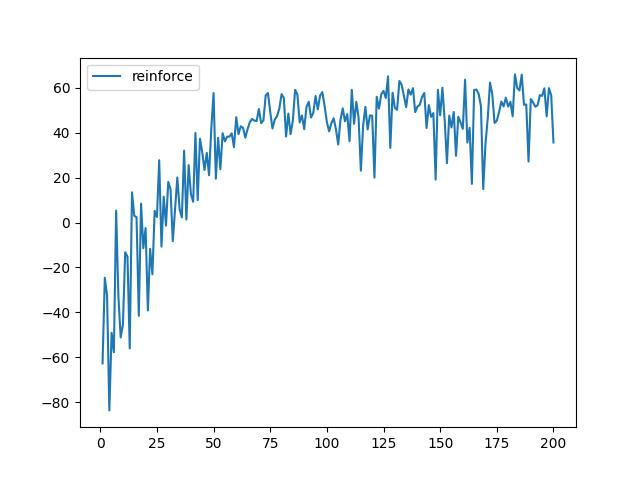

# 强化学习第四次作业报告

## 任务一： Bandit算法和REINFORCE算法

需要实现三种Bandit算法（epsilon-greedy、Thompson采样和UCB），以及简单的REINFORCE算法。强化学习环境为多臂老虎机问题 ( Multi-armed bandit problem, MAB )。多臂老虎机是一个赌博问题，要在未知每个老虎机收益概率分布情况下做到收益最大化，需要平衡exploitation和exploration。

#### Epsilon-Greedy 算法

选一个 (0,1) 之间较小的数$\epsilon$，每次以$\epsilon$的概率在所有臂中随机选一个(exploration)，每次以$1-\epsilon$的概率选择目前平均收益最大的臂(exploitation)。

参数$\epsilon$随着轮数降低，$\epsilon = 1.0/iter$，类似模拟退火算法。

在本题的多臂老虎机的MDP模型中，共有|A|个老虎机，可以选择A个动作，而状态只有一个，因此不用考虑状态转换问题。

在每一个`episode`，关键的代码为：

```python
epsilon = 1.0 / (i + 1)  
# 类似模拟退火思想，epsilon逐渐下降，加一防止除以0
if np.random.uniform(0, 1) < epsilon:
	action = np.random.choice(self.mdp.nActions)
	# exploration : random action selection
else:
	action = np.argmax(np.array(empiricalMeans))
	# exploitation: optimal action selection
```

然后使用已经编写好的方法`reward, _ = self.sampleRewardAndNextState(state, action)`求解action，并`append`进`reward_list`。

为了求解`empiricalMeans`我分别初始化了两个列表`empiricalNum`和`empiricalReward`，分别都是`|A| array`，用于存储每个action出现的次数和reward之和。二者分别初始化为`np.ones`和`np.zeros`

每一个`episode`生成出来`action`和`reward`后，我更新`empiricalMeans[action]`

```python
empiricalNum[action]    += 1
empiricalReward[action] += reward
empiricalMeans[action]  =  empiricalReward[action] / empiricalNum[action]
```


#### Thompson采样算法

Thompson采样算法作出假设：每个臂产生收益的概率`p`分布服从$Beta(a,b)$分布，其中$a=num(win)$，$b=num(lose)$。$Beta$分布如下：
$$
\operatorname{Beta}(a, b)=\frac{\theta^{a-1}(1-\theta)^{b-1}}{B(a, b)} \propto \theta^{a-1}(1-\theta)^{b-1}
$$
每次选择臂时就用现有的$Beta$分布采样$k$次，取平均，作为现有几个$action$的对应预测产生收益概率，选择产生采样值最大的$action$执行。采样过程为：
$$
p^*(action) = \theta ^*=argmax(\theta^{a-1}(1-\theta)^{b-1})
$$
生成`action`方式如下：

```python
samples = np.zeros((self.mdp.nActions, k))
# 记录采样结果
for a in range(self.mdp.nActions):
	for j in range(k):
	# k是采样次数
		samples[a, j] = np.random.beta(prior[a, 0], prior[a, 1])
action = np.argmax(np.mean(samples, axis=1))
```

其中，`prior`表是维护的`beta`分布参数,是一个`|A|x2 matrix`，在生成`reward`之后，需要更新：

```pthon
if reward > 0.5:
	prior[action, 0] += 1  # beta分布的alpha参数
elif reward < 0.5:
	prior[action, 1] += 1  # beta分布的beta参数
```

接下来的求解`empiricalMeans`与上面相同。


#### UCB Bandit算法

UCB 解决 Multi-armed bandit 问题的思路是用置信区间每个action的回报均值都有个置信区间，随着试验次数增加，置信区间会变窄。每次选择前，都根据已经试验的结果重新估计每个action 的均值及置信区间，选择置信区间上限最大的那个action。

先对每一个臂都试一遍，之后在$t>K$时，按照如下公式计算每个臂的分数，然后选择分数最大的臂作为选择：
$$
score(j)=empiricalMean_{j}(t)+\sqrt{\frac{2 \ln t}{empiricalNum_{j, t}}}
$$
`j`指的是选择的老虎机，`t`指的是轮数，加号前面是这个臂到目前的收益均值`empiricalMean`，后面的叫做 bonus，本质上是均值的标准差，其中$empiricalNum_{j, t}$指的是`j`被尝试的次数。后面的一项被尝试的次数越多越低，是一个在朴素bendit算法基础上的惩罚项，可以平衡exploitation和exploration。

```python
ucb_values = empiricalMeans + np.sqrt(2 * np.log(i + 1) / empiricalNum)
action = np.argmax(ucb_values)
```

其中的`empiricalMeans`和`empiricalNum`与$\epsilon-greedy$算法中的相同。

#### Bandit算法结果

运行`testRL2.py`截取Bandit算法部分结果：


testbandit.png

运行`testBandit.py`

结果为：


在本题的条件下，thompson最优。

发现UCB算法在一开始需要一些随机尝试，所以一开始的reward较低，但是由于一开始分数评估中的第一项占优势，所以增长较快。UCB算法能够平衡利用和探索，因此评估出的利用和探索表比较接近真实水平。thompson采样虽然估计出的平均收益不很准确，但是对于高收益action比较敏感，能够估计出真实水平。

Bandit算法可以用于推荐系统，用于解决Exploration and Exploitation(EE问题，探索与开发) 。用Topic 来表示每个用户兴趣，也即 MAB 问题中的臂 ( Arm ) ，通过几次试验，来刻画出新用户心目中对每个Topic的感兴趣概率。如果用户对某个 Topic 感兴趣则获得reward，如果用户对topic不感兴趣则获得regret。长远来看UCB算法更好，因为它刻画的平均收益表最符合真实的情况。

#### Reinfoce算法

Reinfoce算法是基于蒙特卡洛更新方式的Policy Gradient算法。蒙特卡洛更新方式是指每完成一个episode，根据每个时刻的奖励$r_t$都可以获取到，这样就可以计算未来总奖励$G_t$，才进行算法的更新。

与之对应的是Q-learning算法，Q-learning算法是基于价值的算法，而且是时序差分（Temporal-Difference），属于单步更新。

* 首先，在每一个`episode`：利用`softmax`方法根据策略表和`state`获得`action`，如此进行若干`step`，获得了$S_{0}, A_{0}, R_{1}, \ldots, S_{T-1}, A_{T-1}, R_{T}$

* 然后计算$G_t$：`for each step`：$t=0,1, \ldots, T-1$：

  $G \leftarrow \sum_{k=t+1}^{T} \gamma^{k-t-1} R_{k}$

* 最后更新策略参数$theta$：`for each step`：$t=0,1, \ldots, T-1$：

  $\boldsymbol{\theta} \leftarrow \boldsymbol{\theta}+\alpha \gamma^{t} G \nabla \ln \pi\left(A_{t} \mid S_{t}, \boldsymbol{\theta}\right)$

##### softmax生成action

以上第一步中，根据`softmax`方法获得`action`方法如下：

```python
def sampleSoftmaxPolicy(self, policyParams, state):
    # 为了防止数值过大在exp时出现inf元素
    vec = policyParams[:, state] - np.max(policyParams[:, state])
    exp_values = np.exp(vec)
    probabilities = exp_values / np.sum(exp_values)
    # 根据概率分布采样动作
    action = np.random.choice(len(probabilities), p=probabilities)
    return action, probabilities
```

##### 生成未来收益列表$G_t$

第二步，根据$G \leftarrow \sum_{k=t+1}^{T} \gamma^{k-t-1} R_{k}$计算未来收益列表`G_list`

```python
            for t in range(0, nSteps-1):
                running_add = 0
                for k in range(t, nSteps):
                    running_add += gamma ** (k-t) * reward_episode[k]
                G_list.append(running_add)
```

##### MC更新policyParams

第三步，$\boldsymbol{\theta} \leftarrow \boldsymbol{\theta}+\alpha \gamma^{t} G \nabla \ln \pi\left(A_{t} \mid S_{t}, \boldsymbol{\theta}\right)$

首先需要清楚符号含义，$\theta$指的是矩阵`policyParams`，而$\nabla \ln \pi\left(A_{t} \mid S_{t}, \boldsymbol{\theta}\right)$的含义是对数概率的梯度，其中$\nabla$是梯度的意思。

代码中用梯度矩阵`gradLogProb`表示$\nabla \ln \pi\left(A_{t} \mid S_{t}, \boldsymbol{\theta}\right)$。由于我们需要对整个`policyParams`进行更新，所以更新的梯度矩阵`gradLogProb`最终将会是一个与`policyParams`形状相同的矩阵`(array of |A|x|S| entries)`，而其中$gradLogProb[A_t, S_t]=\nabla \ln \pi\left(A_{t} \mid S_{t}, \boldsymbol{\theta}\right)$

为了求解$\nabla \ln \pi\left(A_{t} \mid S_{t}, \boldsymbol{\theta}\right)$，可以联系到`softmax`和`crossEntropy`求解`loss`的结论。

首先经过`softmax`求解出的概率就是
$$
\pi(A_{t} \mid S_{t}, \boldsymbol{\theta}) = p=\left[\frac{e^{z_{1}}}{\Sigma_{k=1}^{n} e^{z_{k}}}, \frac{e^{z_{2}}}{\Sigma_{k=1}^{n} e^{z_{k}}}, \ldots, \frac{e^{z_{n}}}{\Sigma_{k=1}^{n} e^{z_{k}}}\right]
$$
而交叉熵损失$L=-\Sigma_{i=1}^{n} y_{i} \ln \left(p_{i}\right)$其中$y=[0,0,...,1,0,...,0]$，只有$y_i=0$。

如果将`onehot` $y$带入$L=-ln(p_i)=-ln \pi\left(A_{t} \mid S_{t}, \boldsymbol{\theta}\right)$可以看到，我们求解的对数概率实际上与`softmax`的`crossEntropy` `loss`同构。

因此，`loss`对$\theta$的梯度也就与对数概率的$\theta$梯度同构，即：
$$
-\frac{\partial L}{\partial \theta} =\nabla \ln \pi\left(A_{t} \mid S_{t}, \boldsymbol{\theta}\right)
$$
根据`softmax`和`crossEntropy`求解`loss`的结论可知：
$$
\nabla \ln \pi\left(A_{t} \mid S_{t}, \boldsymbol{\theta}\right)=-\frac{\partial L}{\partial \boldsymbol{z}}=-\left[p_{1}, p_{2}, \ldots, p_{j}-1, \ldots p_{n}\right]=\boldsymbol{y}-\boldsymbol{p}
$$
即：对于$t$对应$a$和$s$的$gradLogProb[a_t, s_t] = 1 - prob[a_t, s_t]$而`gradLogProb`其他的元素则采取：$gradLogProb[a_{else}, s_{else}] = - prob[a_{else}, s_{else}]$

但是这样算法并不收敛，由于公式只关注了$A_{t}$和$S_{t}$所以就只修改了算法，处理`gradLogProb`一个点了，`gradLogProb`其他点置$0$。

```python
# 更新策略参数表policyParams
for s in range(self.mdp.nStates):
    # 由策略表policyParams生成概率表probility
    _, prob = self.sampleSoftmaxPolicy(policyParams, s)
    probility.append(prob)
probility = np.transpose(probility)

for t in range(nSteps - 1):
    gradLogProb = np.zeros((self.mdp.nActions, self.mdp.nStates))
    # 第t步的action和state对应的元素进行修改
    a = actions[t], s = states[t]
    gradLogProb[a, s] = 1 - probility[a, s]
    # softmax和cross entropy结合的求导过程最终就是pred_i - label_i
    policyParams += alpha * (gamma ** t) * gradLogProb * G_list[t]
    # alpha * gamma^{t} * G_t * gradLogProb
```


##### 算法debug

在Reinfoce算法计算中，我出现了四个问题：

* 计算softmax函数时，如果遇到一个非常大的数，可能会导致计算结果中出现无穷大

* 应该使用概率值进入计算,`gradLogProb[a, s] = 1 - probility[a, s]`而不是policy值，我一开始用了`gradLogProb[a, s] = 1 - policyParams[a, s]`是错误的

* 应该只对正确的进行奖励，`gradLogProb[a, s] = 1 - probility[a, s]`而其他的`gradLogProb[else]`不作处理。

* 计算`probility`出现了失误`_, prob = self.sampleSoftmaxPolicy(policyParams, s)`中的`s` 误写作`state`导致计算出的`probility`不正确。

以上是debug


#### Reinforce算法与Q-learning对比

Reinforce算法最终运行结果：

`testRL2.py`运行结果：

这里输出的是最后的`policy`矩阵：


`testRL2Maze.py`运行结果，这里是运行了5次的`rewardList`进行平均：



换用`Q-learning`算法进行对比，都运行`100`轮，其中`Q-learning`算法也换用了累积折扣回报作为`rewardList`：


从图中看到，策略方法`Reinforce`收敛速度比值方法`Q-learning`要快，但是最终`reward`收敛值却并没有`Q-learning`高。

第一点，`Reinforce`收敛速度快，首先，这是因为`Reinforce`通过`softmax`策略表，自动实现了探索和利用的平衡，而`Q-learning`算法中，我使用了$\epsilon-greedy$方法，所以一开始大量存在随机选择动作行为，而策略方法`Reinforce`的平衡性更好，所以在初期也能获得较高的`reward`。

另外，`Q-learning` 算法使用固定Q值更新策略，而 Reinforce 则通过梯度上升更新策略。在某些情况下，Reinforce 比 Q-learning 更样本有效，因为它可以更快地利用新的信息。

第二点，`Reinforce`的`reward`收敛值不高，这是因为`Reinforce` 通常用于具有连续动作空间的问题，而 `Q-learning` 更适合具有离散动作空间的问题。本问题是一个离散空间问题，所以`Q-learning`更能准确估计环境的值函数，从而作出准确行为。假如是连续动作空间问题，`Reinforce`表现会更好。

## 任务二：深度REINFORCE算法

深度方法需要补全`loss`

在程序中，`log_probs`是对数策略梯度，`returns`是reversed discounted reward sum，不过深度方法与经典算法不同，它无需考虑` alpha * (gamma ** t) `而是直接用二者相乘。

我的补全的方法是：

```python
objective = -torch.sum(log_probs * returns).to(DEVICE)
```

也即`log_probs` 与`returns`逐个相乘，然后相加为`sum`后取负值。只是没有了` alpha * (gamma ** t) `，其他部分完全按照上面的`reinforce`算法。

在`args.mode == "cartpole"`情况下，在经典的gym cartpole环境中进行训练，最终运行结果：


训练过程图像：


程序debug：

* 安装gym需要严格安装要求的版本`gym==0.26.0`这样才可以正常运行

* 计算`loss`的时候，我一开始使用的方法是：

  ```python
  returns = torch.flip(returns, dims=[0])
  objective = -torch.sum(log_probs * returns).to(DEVICE)
  ```

  为什么上面会有一行反转呢？

  这是因为一开始不知道`n`如何处理，于是代入进去计算，进行了多番修改之后，终于第二行代码写对了，但是上面加上了这一行之后效果竟然也还可以，后来的修改就忘记了第一行代码，总之我查看了历史版本，其实都差别不大，但是总是不能得出正确的结果，看了很着急。

  究其原因，是因为不懂最基本的常识，比如一开始写的是`objective = -log_probs * returns`，如果懂得加上sum那就不必修改良久。

  代码修改次数过多就容易忘记中间的修改进化树，容易抱残守缺，还是应该多多提升代码能力。


## 任务三：模仿学习


安装`box2d`的`seig.exe`报错可以通过下面方式解决：

```python
pip install swig
pip install box2d-py==2.3.8
```

而运行程序过程中出现的报错可以通过严格按照`gym`版本`gym==0.11.0`来解决。

#### Behavior Cloning

补全Behavior Cloning(BC)算法,补全所给资料中irl_BipedalWalker.py文件的BehaviorCloning类中的train方法中的loss函数（一行），训练模型，并绘制reward曲线。

虽然行为克隆的目的与强化学习中的策略学习类似，但是行为克隆的本质是监督学习（分类或者回归），而不是强化学习。行为克隆通过模仿人类专家的动作来学习策略，而强化学习则是从奖励中学习策略。

数据集由（状态，动作）这样的二元组构成，学习目标为：
$$
\theta *=\underset{\theta}{\arg \min } E_{(s, a) B}\left[L\left(\pi_{\theta}(s), a\right)\right]
$$
若动作是连续的，该损失函数可以是均方误差函数。

补全代码为：

```python
loss = criterion(exp_action, outputs)
```

训练的`loss`如下所示：


最终训练出`RewardList`如下所示：


BC learning训练基于专家数据，而专家数据也只是由其他强化学习模型训练而来，所以BC learning训练的曲线震动很大，鲁棒性不强。


#### GAIL

GAIL(Generative Adversarial Imitation Learning)的核心思想：策略生成器G和判别器D的一代代博弈，其中，策略生成器G即代码中的`self.actor`，判别器D即代码中的`self.discriminator`。

策略生成器：策略网络，以state为输入，以action为输出。给定D，通过常规的强化学习算法来学习策略网络，其中reward通过D得出，即该样本与专家样本的相似程度

判别器：二分类网络，将策略网络生成的 (s, a) pair对为负样本，专家的(s,a)为正样本。给定G，在与环境交互中通过G生成完整或不完整的episode(但过程中G要保持不变)作为负样本，专家样本作为正样本来训练D

##### 判别器

判别器loss计算方式:
$$
L=\frac{1}{N} \sum_{i}-\left[y_{i} \cdot \log \left(p_{i}\right)+\left(1-y_{i}\right) \cdot \log \left(1-p_{i}\right)\right]
$$
判别器的loss代码为:

```python
expert_loss = F.binary_cross_entropy_with_logits(q_value_tar, 
                                 torch.ones(q_value_tar.size()).to(self.device))
policy_loss = F.binary_cross_entropy_with_logits(q_value, 
                                 torch.zeros(q_value.size()).to(self.device))           loss_discriminator = expert_loss + policy_loss
```

这里的损失函数由两个部分组成，来自expert的(s,a)样本被设为label 1，而来自当前policy的(s,a)样本被设为label 0，要使得专家数据预测标签更倾向于1，使得policy数据预测标签更倾向于0。

随后由判别器D生成reward:
$$
r(x)=\log \left(\frac{D(x)}{1-D(x)}\right)
$$
代码表示为：

```python
policy_d = self.discriminator(state, action).squeeze()
score = torch.sigmoid(policy_d)
gail_rewards = score.log() - (1 - score).log()
```

##### 生成器

随后用PPO算法来训练actor

根据reward来生成returns，从当前状态开始，将未来的奖励按照指定的折扣因子进行累计，直至到达最终状态或者达到指定的步数。

```python
			returns = torch.zeros_like(gail_rewards)  
            for t in reversed(range(len(gail_rewards))):
                if t == len(gail_rewards) - 1:
                    returns[t] = gail_rewards[t]
                else:
                    returns[t] = gail_rewards[t] + self.gamma * returns[t + 1] 
```

 然后根据未来奖励，通过PPO算法计算loss，生成器loss代码如下：

```python
values = self.actor(state)
adv = returns - torch.mean(values, axis=1)
ratio = torch.mean(torch.exp(logp - logp))
surr1 = ratio * adv
surr2 = torch.clamp(ratio, 0.8, 1.2) * adv
loss_actor = torch.min(surr1, surr2).mean()
loss_actor.backward(retain_graph = True)
```

最终得出actor的loss图像如下：


得出Discriminator的loss图像如下：


最终得出reward曲线如下：


与BC学习相比较，GAIL训练的曲线更加稳定，而且需要较少的轮数就可以提升reward，GAIL的优点是可以学到更复杂的策略，但是实际上训练所需的时间很长。

比起监督学习，对抗学习学习的鲁棒性会更强，从上面的图像中可以看到，GAIL的reward曲线更加稳定。


## 任务四：部分可观测强化学习

首先，在部分可观测Cartpole环境下运行已给出的DQN模型，绘制奖励曲线，作为和DRQN比较的baseline，在原参数下，运行结果为：


传统的DQN有两点局限性： 1. 经验数据存储的内存有限。 2. 需要完整的观测信息。因此提出部分可观测强化学习。Cartpole环境被修改为一个部分可观测环境，其中智能体只能观察到真实完整状态的一部分。
